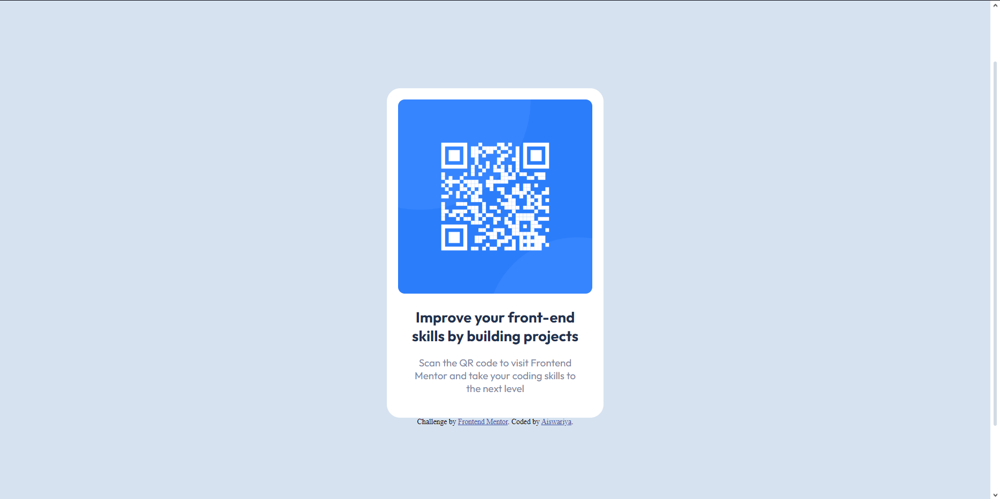

# Frontend Mentor - QR code component solution

This is a solution to the [QR code component challenge on Frontend Mentor](https://www.frontendmentor.io/challenges/qr-code-component-iux_sIO_H). Frontend Mentor challenges help you improve your coding skills by building realistic projects. 

## Table of contents

- [Overview](#overview)
  - [Screenshot](#screenshot)
  - [Links](#links)
- [My process](#my-process)
  - [Built with](#built-with)
  - [What I learned](#what-i-learned)
  - [Continued development](#continued-development)
  - [Useful resources](#useful-resources)
- [Author](#author)
- [Acknowledgments](#acknowledgments)

**Note: Delete this note and update the table of contents based on what sections you keep.**

## Overview

### Screenshot



### Links
- [Live Site URL](https://qrcode-fm-1.netlify.app/)

## My process

### Built with

- Semantic HTML5 markup
- CSS custom properties
- Flexbox
- Mobile-first workflow

### What I learned

Working on this project helped me solidify my understanding of responsive design and CSS Flexbox. Here are a few key takeaways:

- **Semantic HTML5**: Ensuring the HTML structure is semantic for better accessibility and SEO.
- **CSS Flexbox**: Using Flexbox for aligning items in a clean and responsive manner.
- **Google Fonts**: Integrating custom fonts from Google Fonts for better typography.

Here are the code snippet demonstrating parts of the project I'm proud of:

```css
html,
body {
  margin: 0;
  height: 100%;
  background-color: hsl(212, 45%, 89%);
}

.main {
  margin-top: 16%;
  display: flex;
  align-items: center;
  justify-content: center;
}

.card {
  background-color: hsl(0, 0%, 100%);
  justify-content: center;
  align-items: center;
  text-align: center;
  max-width: 290px;
  padding: 17px;
  border-radius: 20px;
}

.card img {
  border-radius: 10px;
  max-width: 100%;
  max-height: 100%;
}

.heading {
  font-family: "Outfit", sans-serif;
  font-size: 22px;
  font-weight: 700;
  color: #1f314f;
  padding-top: 17px;
}

.subheading {
  font-family: "Outfit", sans-serif;
  font-size: 15px;
  font-weight: 400;
  color: hsl(220, 15%, 55%);
  padding: 17px;
}
```

### Continued development

In future projects, I want to focus on:

- Enhancing my understanding of CSS Grid for more complex layouts.
- Improving accessibility features in my projects.
- Exploring modern CSS frameworks and libraries to speed up development.

### Useful resources

- [MDN Web Docs](https://developer.mozilla.org/en-US/) - Comprehensive resource for web development documentation and best practices.
- [CSS-Tricks](https://css-tricks.com/) - Great resource for CSS techniques and tips.
- [Google Fonts](https://fonts.google.com/) - For integrating custom fonts.

## Author
- Frontend Mentor - [@Aiswariya3a](https://www.frontendmentor.io/profile/Aiswariya3a)

## Acknowledgments

Special thanks to the Frontend Mentor community for their support and feedback. This project was a great learning experience, and the community's input was invaluable.
